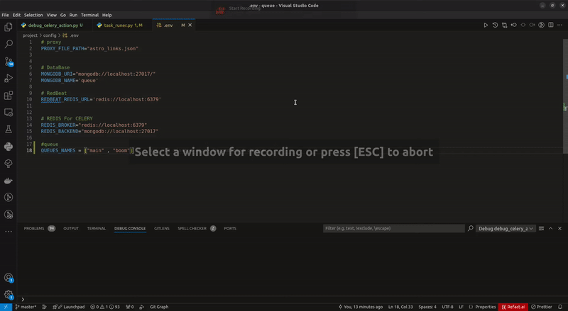
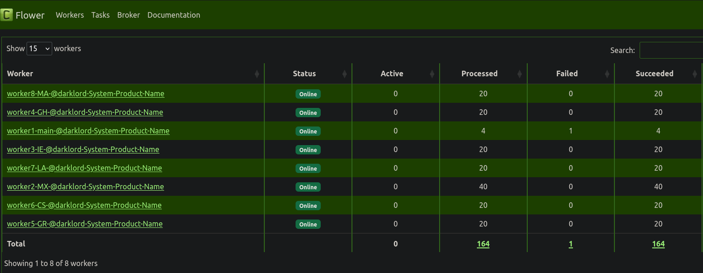
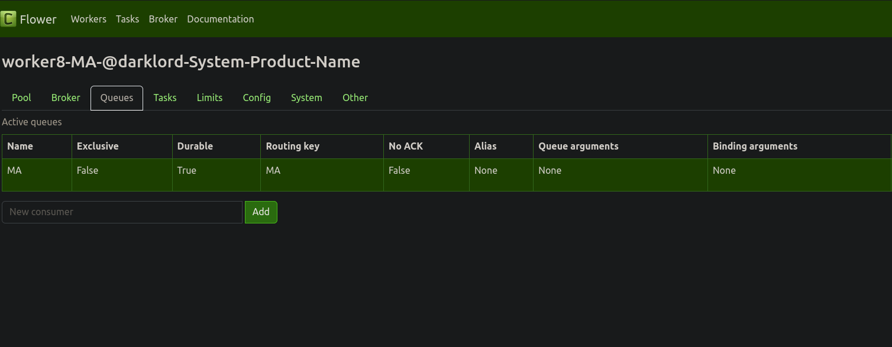
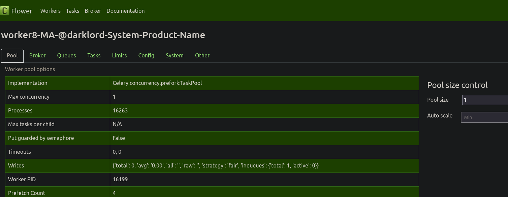

<div>

### --- for use celery in debug mode you can flow this gif ---
#### notice :
- You can use this method to keep track of submitted tasks and test code without having to bring up a lot of workers. You can use this method with a single worker and just specify the queue name and you can even use it in tests like pytest or unitest.
  




### Built With


* This project was created by <span >Evans</span> and all the rights of this project belong to Danesh Gostar Sina Company !!! 

<hr>


<!-- GETTING STARTED -->
## Getting Started

The main task of this script is to read the proxies file and then create unique workers, each of which has a queue and concurrency 1, which allows us to run different tasks simultaneously without any interference, and we can switch between Choose one or more workers for our purpose
And this action is done in such a way that by giving the name of the queue , the worker is aware of himself and performs the task :)


<br>

### Installation

_You can download the project through the link below._

* Clone the repo

   ```sh
   https://github.com/ali-derogar/CeleryTaskManager.git
   ```
<br>

### Requisites
<br>

All the required libraries are in the requirement.txt file. Proceed as follows.


  ```sh
  pip install -r requirement
  ```

<br>
<!-- USAGE -->
## Usage


**These issues should be considered for use**

1. Make sure to create cookies folder and target folder before use.
   To create workers, just run the execution.py file once, then you can call your tasks in the task_runer.py file. Run task_runer.py at the end for successful execution

    <br>
2. Do these steps in order:
   <br>
    ```sh
      TO RUN FLOWER ==> celery -A src flower 
      ```
    ```sh
      TO RUN WORKER MAKER ==> python execution .py 
      ```
    ```sh
      TO EXECUTION YOUR TASK ==> python task_runer.py
    ```
    <br>

<p align="right">(<a href="#readme-top">back to top</a>)</p>


<!-- Project_Map -->
## Project_Map

```text 
├── config
│   ├── config_file.py
│   ├── env.sample
│   └── __init__.py
├── db
│   └── mongo.py
├── execution.py     *main*
├── README.md
├── requirement.txt
├── src
│   ├── astro_links.json
│   ├── celeryconfig.py
│   ├── celery.py
│   ├── exceptions.py
│   ├── __init__.py
│   ├── log.py
│   ├── tasks.py
│   └── utils.py
└── task_runer.py    *main*

```


<p align="right">(<a href="#readme-top">back to top</a>)</p>

<!-- Configure -->
## important section

**default worker name is (((((((main)))))))**:


<p align="right">(<a href="#readme-top">back to top</a>)</p>


<!-- Hints -->
## Hints

* If you have done the steps correctly, you should be able to see something like this in the Flower environment after executing the commands


*all worker are online*

<hr>

*specific worker MA*

<hr>

*Each queue has only one concurrency*


</div>